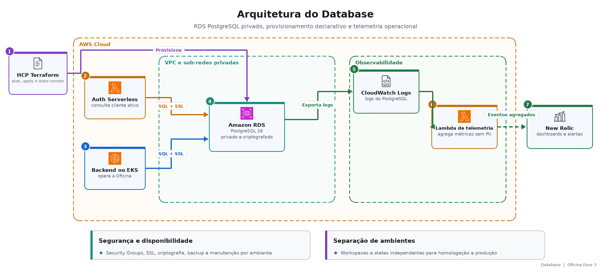

# Oficina Fase 3 — Database

Documentação do banco gerenciado, do modelo relacional e dos controles de consistência e desempenho. A visão completa da Oficina está no [repositório central](https://github.com/tiagomiele/backend).

Projeto de implementação: [fiap-tech-challenge-fase3-oficina-database-infra](https://github.com/tiagomiele/fiap-tech-challenge-fase3-oficina-database-infra)

## Visão de negócio

O Database preserva a memória operacional da oficina. Nele ficam clientes e sua situação cadastral, veículos, catálogos, estoque, fornecedores, Ordens de Serviço, históricos de status e lançamentos financeiros.

Essa base permite autenticar somente clientes ativos, manter a rastreabilidade do atendimento, impedir inconsistências de estoque e produzir relatórios e indicadores. Por isso, privacidade, integridade, recuperação e desempenho são requisitos de negócio, não apenas decisões técnicas.

## Responsabilidades

- provisionar Amazon RDS PostgreSQL privado e criptografado;
- restringir conectividade aos componentes autorizados;
- configurar armazenamento, backup, manutenção e proteção por ambiente;
- exportar logs e telemetria agregada sem expor dados pessoais;
- fornecer outputs de conexão sem usuário ou senha;
- manter states HCP independentes para homologação e produção;
- documentar o modelo relacional, relacionamentos, constraints e índices.

As migrations Flyway V1–V4 permanecem no Backend como fonte executável do schema. Este projeto entrega o serviço gerenciado e não duplica a definição funcional das tabelas.

## Arquitetura do componente



## Modelo arquitetural e práticas

O projeto utiliza **Infrastructure as Code declarativa**. Terraform descreve RDS, subnet group, security group, parâmetros, backup, logs, telemetria e outputs. O plan permite revisar impactos antes do apply, e o state remoto separa homologação de produção.

O modelo de dados é relacional e normalizado, com PKs, FKs, chaves compostas, constraints e índices orientados às consultas reais. O Backend controla as transações e migrations; o banco reforça invariantes que não devem depender apenas da aplicação.

Clean Architecture é aplicada ao Backend, não ao repositório Terraform. Aqui, as práticas equivalentes são separação de responsabilidades, configuração por variáveis, mínimo privilégio de rede, ausência de segredos no Git, validação estática e documentação das decisões.

## Stack e ferramentas

| Área | Tecnologias |
|---|---|
| Banco | Amazon RDS PostgreSQL 16, SSL, backup e logs PostgreSQL |
| Modelo funcional | Flyway, SQL relacional, constraints e índices |
| Infraestrutura | Terraform, HCP Terraform, AWS Security Groups e sub-redes privadas |
| Telemetria | CloudWatch Logs, Lambda Python, EventBridge e New Relic Event API |
| Qualidade | Terraform Validate, TFLint, testes Python e validação do diagrama ER |
| Segurança | Checkov, Trivy, Gitleaks e revisão de parâmetros sensíveis |
| Entrega | GitHub Actions, GitHub Environments e sincronização de outputs |

## Execução e deploy

Validação local do projeto original:

```bash
terraform fmt -check -recursive
terraform init -backend=false -input=false -lockfile=readonly
terraform validate
tflint --recursive
python3 scripts/validate_docs.py
```

Pull Requests executam CI e Terraform Plan sem apply. O merge em `homolog` provisiona homologação e sincroniza a conexão com Auth e Backend. A promoção para `main` executa produção sob o GitHub Environment protegido.

- [CI/CD integrado da solução](https://github.com/tiagomiele/fiap-tech-challenge-fase3-oficina-backend/blob/documentation/docs/cicd-promocao.md)
- [Bootstrap AWS](https://github.com/tiagomiele/fiap-tech-challenge-fase3-oficina-backend/blob/documentation/docs/bootstrap-aws-do-zero.md)
- [Evidência histórica do apply de produção](https://github.com/tiagomiele/fiap-tech-challenge-fase3-oficina-database-infra/actions/runs/34529053307)

## Documentação técnica

- [Modelo relacional e relacionamentos](docs/modelo-relacional.md)
- [Visualização do modelo relacional](docs/assets/modelo-relacional-database.png)
- [Fonte Mermaid editável do diagrama ER](docs/diagrams/er-model.mmd)
- [Consistência do modelo](docs/adr/0001-consistencia-modelo.md)
- [Índices e desempenho](docs/indices-desempenho.md)
- [RFC da escolha do PostgreSQL](https://github.com/tiagomiele/fiap-tech-challenge-fase3-oficina-backend/blob/documentation/docs/decisions/rfc/0002-postgresql-rds.md)

## Swagger/Postman

Não aplicável: este repositório não publica APIs. Os contratos da solução estão no [índice central de APIs e testes](https://github.com/tiagomiele/fiap-tech-challenge-fase3-oficina-backend/blob/documentation/docs/evidencias.md).

O banco não possui endpoint público. Evidências devem utilizar pipelines e consultas autenticadas, sempre sem publicar credenciais ou dados pessoais.
